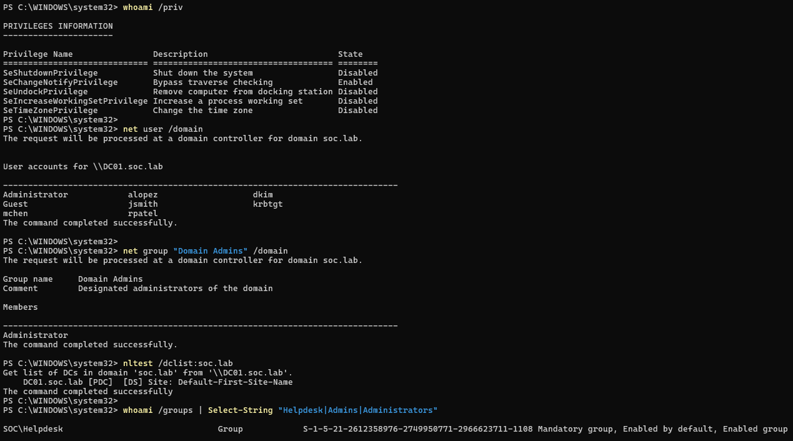
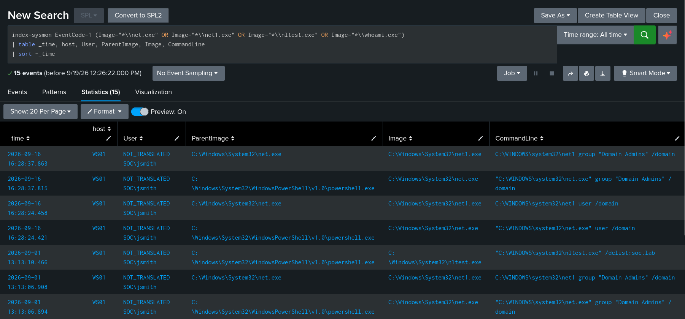
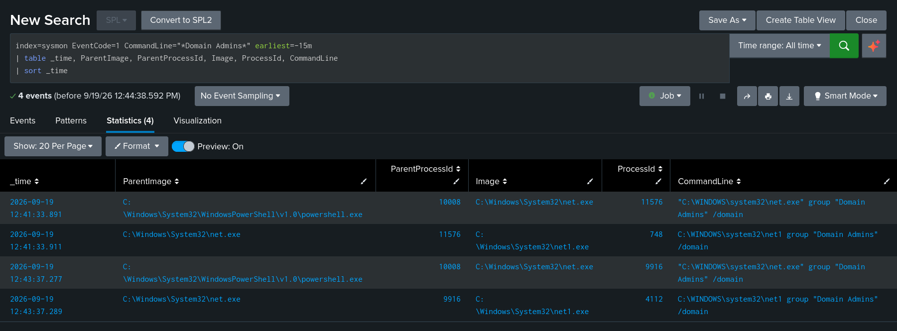
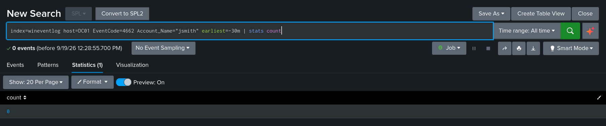
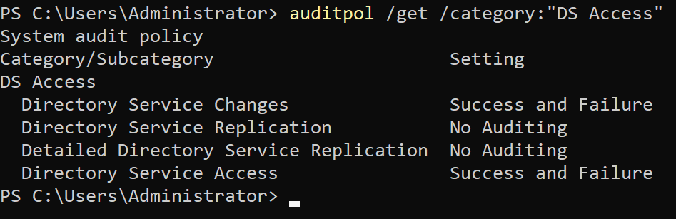
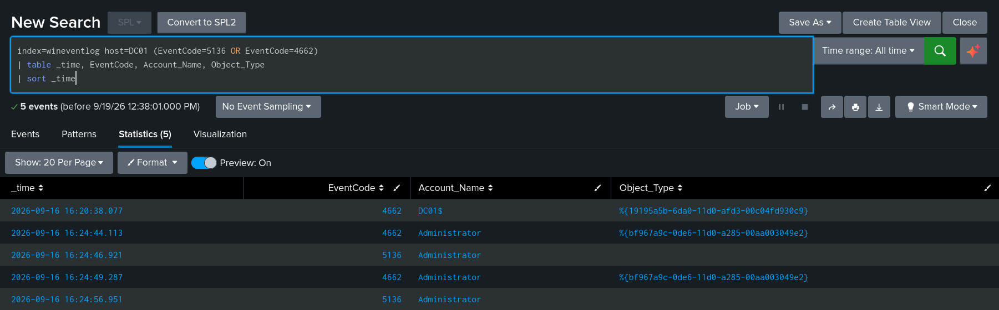
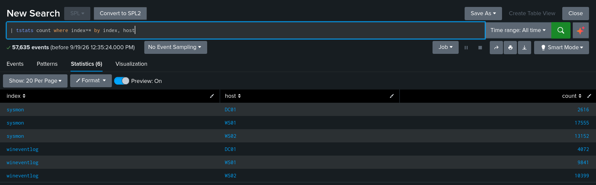

# Project 01 — AD Telemetry Pipeline & Discovery Detection

**Techniques:** [T1087.002 — Account Discovery: Domain Account](https://attack.mitre.org/techniques/T1087/002/), [T1069.002 — Permission Groups Discovery: Domain Groups](https://attack.mitre.org/techniques/T1069/002/)  
**Data sources:** Sysmon Event ID 1, Windows Security log  
**Outcome:** Technique detected on the endpoint with full process ancestry. **Domain controller recorded nothing**, traced to three independent causes.

---

## Summary

An unprivileged domain user enumerated every account in the domain, the full membership of Domain Admins, and the domain controller inventory. Four commands, no credentials beyond a standard user logon, no errors.

Endpoint telemetry captured all of it — six events with parent process, command line, and user attribution. The domain controller, which served every one of those requests, logged nothing that identifies the activity.

This writeup covers the detection, the gap, and the verification that the gap is real rather than a misconfiguration.

---

## Why this technique

Discovery is the phase between initial access and everything that follows. An attacker who lands on a workstation does not know the domain layout, who the privileged users are, or where to go next and the fastest way to find out is to ask Active Directory, which will answer.

It is also the phase most likely to be missed. Nothing fails, no privilege is escalated, and the commands are ones administrators run legitimately. If it is not detected here, the next observation point is usually credential access, by which time the attacker has a target list.

---

## Attack

Executed on `WS01` as `SOC\jsmith` — a standard domain user whose only group membership is `Helpdesk`.

```powershell
whoami /all
net user /domain
net group "Domain Admins" /domain
nltest /dclist:soc.lab
```

Privileges held by the account at execution time:

```
SeShutdownPrivilege           Disabled
SeChangeNotifyPrivilege       Enabled
SeUndockPrivilege             Disabled
SeIncreaseWorkingSetPrivilege Disabled
SeTimeZonePrivilege           Disabled
```

Nothing there permits directory enumeration. All four commands succeeded anyway:

```
PS C:\> net user /domain
The request will be processed at a domain controller for domain soc.lab.

User accounts for \\DC01.soc.lab
-------------------------------------------------------------------------------
Administrator            alopez                   dkim
Guest                    jsmith                   krbtgt
mchen                    rpatel
The command completed successfully.

PS C:\> net group "Domain Admins" /domain
Group name     Domain Admins
Comment        Designated administrators of the domain

Members
-------------------------------------------------------------------------------
Administrator
The command completed successfully.
```



This is not a lab misconfiguration. `Authenticated Users` holds read access across most of the directory by default, because domain-joined systems and applications depend on it. **Reconnaissance in Active Directory is not prevented — it is detected, or it is missed.**

---

## Detection

### Splunk

```spl
index=sysmon EventCode=1
  (Image="*\\net.exe" OR Image="*\\net1.exe" OR Image="*\\nltest.exe" OR Image="*\\whoami.exe")
| table _time, host, User, ParentImage, Image, CommandLine
| sort -_time
```

### Result — 6 events

| Time | Host | User | ParentImage | Image | CommandLine |
|------|------|------|-------------|-------|-------------|
| 13:13:10 | WS01 | SOC\jsmith | `powershell.exe` | `nltest.exe` | `nltest.exe /dclist:soc.lab` |
| 13:13:06 | WS01 | SOC\jsmith | `net.exe` | `net1.exe` | `net1 group "Domain Admins" /domain` |
| 13:13:06 | WS01 | SOC\jsmith | `powershell.exe` | `net.exe` | `net.exe group "Domain Admins" /domain` |
| 13:13:02 | WS01 | SOC\jsmith | `net.exe` | `net1.exe` | `net1 user /domain` |
| 13:13:02 | WS01 | SOC\jsmith | `powershell.exe` | `net.exe` | `net.exe user /domain` |
| 13:12:53 | WS01 | SOC\jsmith | `powershell.exe` | `whoami.exe` | `whoami.exe /all` |



Four commands, six events, complete attribution.

### The `net.exe` → `net1.exe` pairing

Every `net` invocation produced **two** process-creation events. `net.exe` is a thin wrapper that re-executes as `net1.exe` — behavior retained from Windows NT, where `net.exe` was a 16-bit stub.

This matters when writing rules:

- Matching `net.exe` only: catches the technique, one alert per command.
- Matching both: catches it, **two alerts per command** — inflated volume and a misleading count in any metric built on alert totals.
- Matching `net1.exe` only: still catches it, and survives an attacker who calls `net1.exe` directly to evade a `net.exe` rule.



The approach used in the [Sigma rule](../sigma/net_domain_discovery.yml) is to match both images and exclude `net1.exe` whose `ParentImage` is `net.exe` — preserving direct-invocation coverage while removing the duplicate.

---

## Findings

### The domain controller recorded nothing

`DC01` served every one of those requests. Searching it for directory access:

```spl
index=wineventlog host=DC01 (EventCode=4661 OR EventCode=4662)
```

**Zero results.**



Three independent causes, each sufficient on its own.

#### 1. DS Access auditing was disabled

```
PS C:\> auditpol /get /category:"DS Access"

DS Access
  Directory Service Changes               No Auditing
  Directory Service Replication           No Auditing
  Detailed Directory Service Replication  No Auditing
  Directory Service Access                No Auditing
```

Off by default, and not included in the initial GPO.

#### 2. Event 4662 requires a SACL on the target object

Object Access auditing in Windows is opt-in **per object**. The audit subcategory is a master switch; the System Access Control List on each object decides what is actually recorded. Default AD ships with essentially no SACLs auditing *reads* on user and group objects.

Enabling the subcategory alone changes nothing for this technique.

#### 3. `net user /domain` does not use LDAP

The decisive reason. `net.exe ... /domain` queries the DC over **SAMR** — a legacy RPC interface carried on SMB named pipes that predates LDAP. It does not traverse the LDAP stack and generates no 4662 regardless of audit configuration.

`nltest /dclist:` is different again: a DNS SRV lookup followed by a DC locator RPC call, producing nothing security-relevant.

### Verification

Rather than accept the negative result, DS Access auditing was enabled (both `Directory Service Access` and `Directory Service Changes`, Success + Failure) and the enumeration re-run.

4662 then returned **three** events — none of them the enumeration:

| Time | Account | Object Type GUID | Class | Access |
|------|---------|------------------|-------|--------|
| 16:20:38 | `DC01$` | `19195a5b-6da0-11d0-afd3-00c04fd930c9` | `domainDNS` | Control Access |
| 16:24:44 | `Administrator` | `bf967a9c-0de6-11d0-a285-00aa003049e2` | `group` | Write Property |
| 16:24:49 | `Administrator` | `bf967a9c-0de6-11d0-a285-00aa003049e2` | `group` | Write Property |



The first is the DC's own internal directory operation. The second and third are an unrelated control test — a group membership add and remove, five seconds apart.

Filtering to the user who ran the enumeration:

```spl
index=wineventlog host=DC01 EventCode=4662 Account_Name="jsmith" earliest=-30m
| stats count
```

**Zero.** The negative result holds with auditing fully enabled.

### What the DC *is* instrumented for

The same control test that produced those two 4662 events also produced 5136 events, interleaved:

```
16:24:44  4662  Write Property     ← access check on the group object
16:24:46  5136  directory change   ← attribute modification (add)
16:24:49  4662  Write Property     ← access check
16:24:56  5136  directory change   ← attribute modification (remove)
```



Two subcategories recording two aspects of the same action: 4662 that permission to write was checked and granted, 5136 what the value actually became.

This reveals the real shape of AD's default instrumentation. **The domain naming context carries a default SACL that audits writes** — permission changes, extended rights, property modifications — which is why 5136 works with no per-object configuration at all. What is absent is auditing on **reads**.

> **Active Directory is well-instrumented for modification and blind to enumeration by default.**

That asymmetry is the finding. It is also a practical rule for building detections: use **5136** for AD persistence and privilege change monitoring; do not expect **4662** to surface reconnaissance.

### Visibility matrix

| Activity | Endpoint (Sysmon) | Domain Controller (Security log) |
|----------|-------------------|----------------------------------|
| Domain account/group enumeration | 6 events, full process ancestry | **nothing** |
| Group membership modification | — | 5136 + 4662, complete |

### Implications

Without endpoint telemetry on workstations, this technique is invisible. The DC-side evidence amounts to a Type 3 logon and Kerberos service ticket requests — a record that `jsmith` authenticated to `DC01` from `10.10.10.100`, indistinguishable from any normal workday.

Microsoft's own answer to SAMR enumeration is the `RestrictRemoteSam` policy — a **prevention** control — rather than improved logging, because the logging is not there to improve.

For DC-side detection, the options are network inspection of SMB named pipe traffic (Zeek/Suricata, covered in Project 05) or a product that inspects the protocol directly on the DC, such as Defender for Identity.

---

## Tuning

The rule as written has an obvious problem: `net.exe` is legitimate administrative tooling, used constantly by scripts, logon processes, and management software.

A concrete example appeared in this environment's own telemetry. The Splunk forwarder's startup sequence produces:

```
splunk.exe → cmd.exe → btool.exe
```

A service binary spawning `cmd.exe` is a pattern most process-creation rules treat as suspicious. Here it is a monitoring agent reading its own configuration.

Baseline data collection is Project 03. The query that starts it:

```spl
index=sysmon EventCode=1 Image="*\\net.exe" earliest=-7d
| stats count by CommandLine, ParentImage, User
| sort -count
```

Tuning decisions this will force, none of which are free:

| Option | Cost |
|--------|------|
| Exclude by `ParentImage` (known management tooling) | Attacker living off that parent process is invisible |
| Exclude service accounts | Compromised service account is invisible |
| Require multiple discovery commands in a short window | Slower attacker evades it; needs stateful correlation |
| Alert only on high-value targets (`Domain Admins`, `krbtgt`) | Broader enumeration missed |

**Whichever is chosen is a documented blind spot, not a solved problem.** That trade-off is the substance of detection engineering; writing the search is not.

---

## Build notes

Environment detail relevant to reproducing this. Two failures during the build were instructive enough to record.

### Forwarder shipping some logs but not others

Post-deployment verification returned four rows where six were expected:

```spl
| tstats count where index=* by index, host
```

```
index         host   count
sysmon        DC01     521
wineventlog   DC01     904
wineventlog   WS01    7206
wineventlog   WS02    7875
```

The workstations were shipping Windows event logs but **no Sysmon data**, despite Sysmon running locally and `inputs.conf` being correct on disk.

Cause: the Splunk MSI installs the service as `NT SERVICE\SplunkForwarder`, a virtual account. The Sysmon channel's ACL:

```
O:BAG:SYD:(A;;0xf0007;;;SY)(A;;0x7;;;BA)(A;;0x1;;;BO)(A;;0x1;;;SO)(A;;0x1;;;S-1-5-32-573)
```

Full access for `SY` (SYSTEM), `BA` (Builtin Administrators), and read for `S-1-5-32-573` (Event Log Readers). The virtual account matches none of them.

```powershell
sc.exe config SplunkForwarder obj= "LocalSystem" type= own
Add-LocalGroupMember -Group "Event Log Readers" -Member "NT SERVICE\SplunkForwarder"
Restart-Service SplunkForwarder
```

Final state:

```
index         host   count
sysmon        DC01    2616
sysmon        WS01   17555
sysmon        WS02   13152
wineventlog   DC01    4072
wineventlog   WS01    9841
wineventlog   WS02   10399
```



> A forwarder that connects successfully and ships *some* logs while silently dropping others is a worse failure than one that is plainly broken — it passes every surface-level health check. Breaking the count down **by index and host** is the check that catches it.

### Cloning a domain-joined VM breaks the original

`WS02` was cloned from a powered-off, already-domain-joined `WS01`. The clone was then unjoined and rejoined to give it a distinct identity — which reset the shared computer account password in AD. `WS01` retained the stale one.

The symptom appeared as DNS: `WS01` never registered its A record, while `WS02` resolved normally. The cause was authentication — `Test-ComputerSecureChannel` returned `False`, and a machine that cannot authenticate cannot perform secure dynamic DNS registration.

`Test-ComputerSecureChannel -Repair` also failed; a full unjoin/rejoin resolved it.

> The failure surfaced in a subsystem two steps removed from its cause, and it broke the **original** rather than the copy. Clone from a pre-join snapshot, or rejoin the original afterward.

### Configuration

<details>
<summary>Audit policy (GPO, linked at domain root)</summary>

| Category | Subcategory | Setting |
|----------|-------------|---------|
| Account Logon | Kerberos Authentication Service | Success + Failure |
| Account Logon | Kerberos Service Ticket Operations | Success + Failure |
| Account Management | User Account Management | Success + Failure |
| Detailed Tracking | Process Creation | Success |
| Logon/Logoff | Logon | Success + Failure |
| Logon/Logoff | Special Logon | Success |
| Object Access | File Share | Success + Failure |
| DS Access | Directory Service Access | Success + Failure |
| DS Access | Directory Service Changes | Success + Failure |

Plus **Include command line in process creation events** — without it, 4688 records a process name and nothing else.

Configuring `auditpol` locally on a domain-joined machine is pointless: GPO overwrites it at the next refresh.

</details>

<details>
<summary>Sysmon</summary>

[SwiftOnSecurity config](https://github.com/SwiftOnSecurity/sysmon-config), deployed to all three hosts.

```powershell
.\Sysmon64.exe -accepteula -i .\sysmonconfig-export.xml
```

Event types observed on a workstation at idle: **1** (process creation), **3** (network connection), **13** (registry value set), **22** (DNS query). Event 22 is high-value and omitted from many default configurations.

</details>

<details>
<summary>Forwarder inputs</summary>

```ini
[WinEventLog://Security]
disabled = 0
index = wineventlog
renderXml = 0

[WinEventLog://Microsoft-Windows-Sysmon/Operational]
disabled = 0
index = sysmon
renderXml = 0

[WinEventLog://Microsoft-Windows-PowerShell/Operational]
disabled = 0
index = wineventlog
renderXml = 0
```

`renderXml = 0` is required — the Splunk TAs parse the classic event format, and XML mode silently breaks field extraction.

</details>

---

## References

- [MITRE ATT&CK T1087.002](https://attack.mitre.org/techniques/T1087/002/)
- [MITRE ATT&CK T1069.002](https://attack.mitre.org/techniques/T1069/002/)
- [SwiftOnSecurity/sysmon-config](https://github.com/SwiftOnSecurity/sysmon-config)
- [Network access: Restrict clients allowed to make remote calls to SAM](https://learn.microsoft.com/en-us/windows/security/threat-protection/security-policy-settings/network-access-restrict-clients-allowed-to-make-remote-sam-calls)
