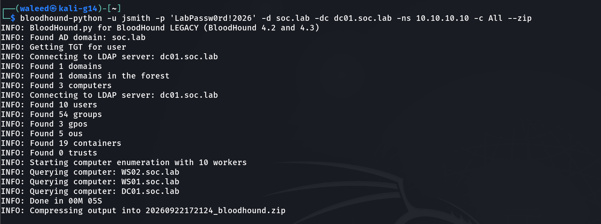
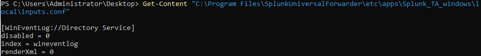
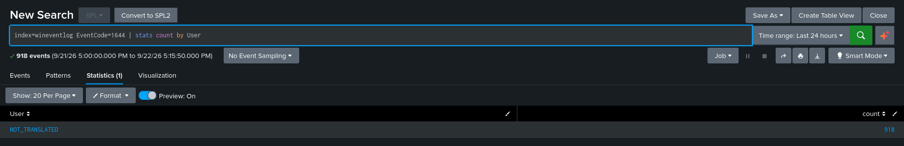
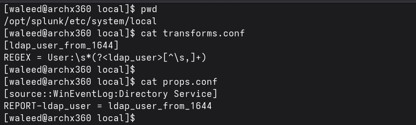
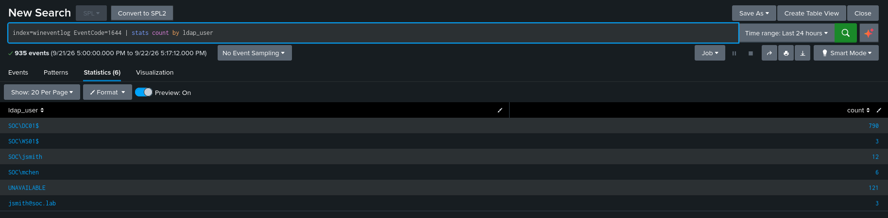
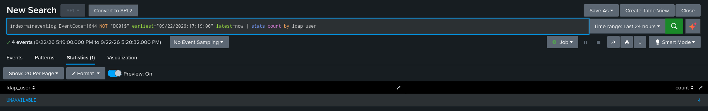
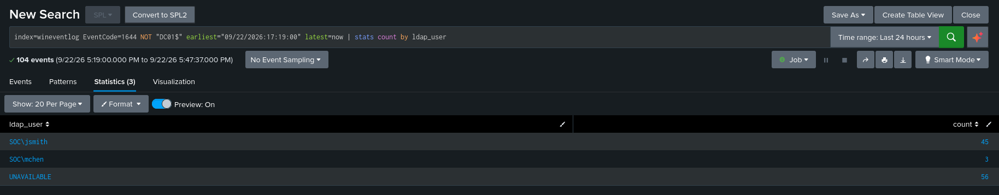
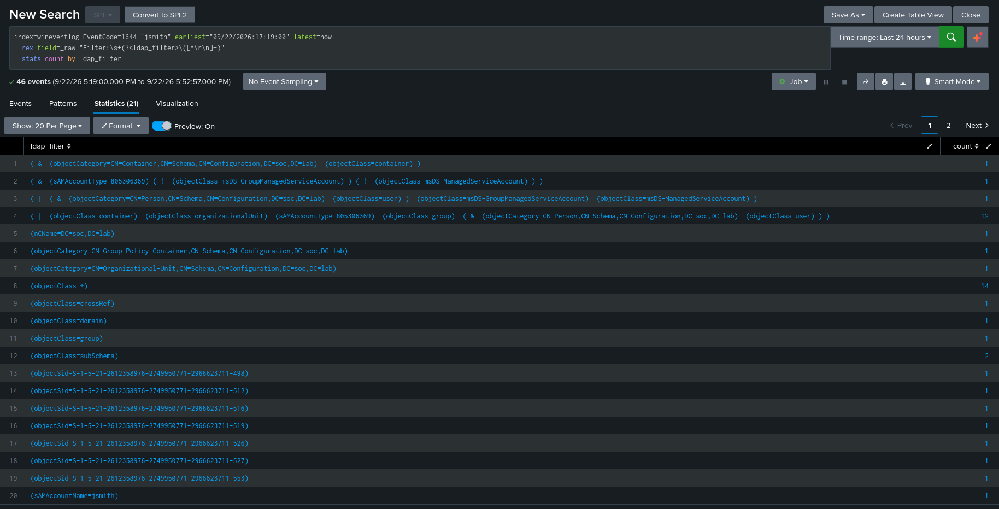
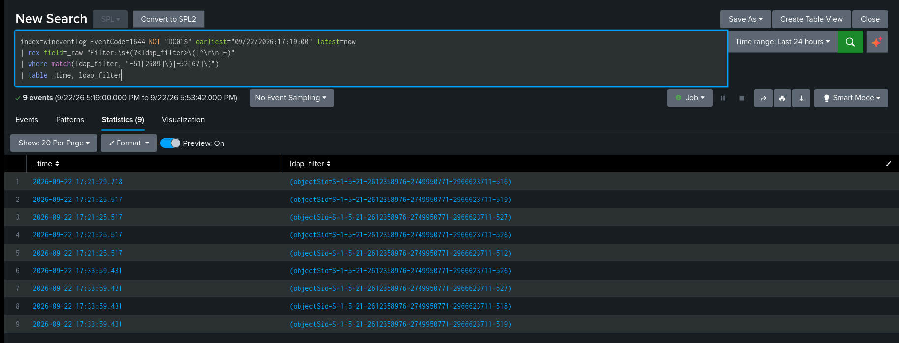
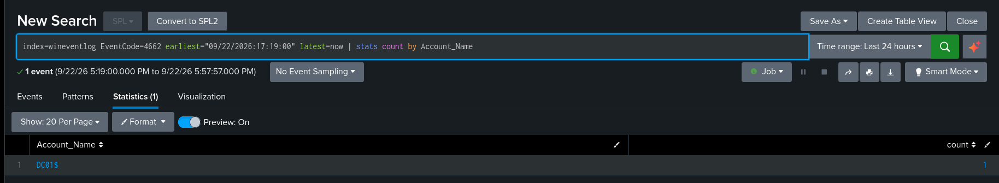

# BloodHound / SharpHound Collection: Detecting AD Enumeration

**Technique:** Account & Permission-Groups Discovery via BloodHound collection —
[T1087.002](https://attack.mitre.org/techniques/T1087/002/),
[T1069.002](https://attack.mitre.org/techniques/T1069/002/)  
**Tactic:** Discovery  
**Attacker position:** Unprivileged domain user (`SOC\jsmith`), assume-breach  
**Target:** Domain-wide directory enumeration from the `soc.lab` domain  

---

## Summary

An unprivileged domain user ran BloodHound collection (`bloodhound-python -c All`)
against the domain, pulling every user, group, computer, ACL, and privileged-group
membership needed to map attack paths with no administrative access. The
collection succeeded in seconds.

The focus of this lab is the **defensive** half: detecting that collection in
Splunk. Two findings dominate, and both are about the gap between what you would
expect to catch this and what actually does.

**Headline finding** — Directory Service Access auditing (event 4662) which is 
the mechanism intended to record directory object access produced **zero**
events attributable to the attacker. BloodHound enumeration is read activity
against objects that carry no read-SACLs, so AD does not audit it. The
only signal that caught the collection was event **1644** (expensive/inefficient
LDAP search) which is **off by default**, thresholded too high by default, and
**not forwarded to Splunk by the stock Windows TA**. Detecting this attack
required building the telemetry pipeline first.

**Second finding** — The collection has a high-fidelity behavioral fingerprint. 
BloodHound enumerates the well-known privileged groups by SID (Domain Admins 512,
Enterprise Admins 519, Key Admins 526, Enterprise Key Admins 527, Domain
Controllers 516) in a single burst — four of them in the *same millisecond*. No
legitimate user or application queries the full set of privileged-group SIDs back
to back. This pattern is a near-zero-false-positive detection signal.

---

## Why this technique

BloodHound maps Active Directory as a graph of principals and the relationships
between them (group membership, ACLs, sessions, admin rights), then computes the
shortest path from any owned account to Domain Admin. Any authenticated domain
user can collect the data, it is almost all readable by default. That makes
collection an early, reliable step in most AD intrusions, and detecting it early
is valuable because it precedes the privilege escalation it enables.

---

## Attack

From Kali (`ATTACK01`, 10.10.10.30) as `SOC\jsmith`:

```
bloodhound-python -u jsmith -p '<password>' -d soc.lab -dc dc01.soc.lab -ns 10.10.10.10 -c All --zip
```

Collected in ~5 seconds: 3 computers, 10 users, 54 groups, 3 GPOs, 5 OUs,
19 containers, 0 trusts. Output bundled to a BloodHound-importable zip.



`-c All` runs every collection method (group membership, ACLs, sessions,
containers, object properties), which is the comprehensive and loud enumeration.

**Graph analysis** &mdash; the collected zip has not yet been ingested.
Ingesting into legacy BloodHound (4.2/4.3) + neo4j to compute the
`jsmith → Domain Admin` path is the outstanding offensive half of this branch.

---

## Building the telemetry pipeline (three non-default fixes)

Detecting this attack is difficult with default configuration. Three changes
were required, each is a finding in itself, because it marks a gap a stock
deployment would have.

**1. Enable 1644 and lower its thresholds (DC01).** Event 1644 (expensive/
inefficient LDAP search) is disabled by default. Enabled via registry:

```
"15 Field Engineering" = 5    (HKLM\SYSTEM\CurrentControlSet\Services\NTDS\Diagnostics)
```
and its search thresholds lowered to 1 so BloodHound's queries cross the logging
threshold:
```
Expensive/Inefficient Search Results Threshold = 1
Search Time Threshold (msecs) = 1
```

**2. Forward the Directory Service log (Splunk).** 1644 lands in the **Directory
Service** channel, which the stock `Splunk_TA_windows` does **not** collect. No
`inputs.conf` referenced it. Added:

```
[WinEventLog://Directory Service]
disabled = 0
index = wineventlog
renderXml = 0
```



Without this, 1644 events are generated on the DC but never reach Splunk — the
attack would be invisible to a default install.

**3. Custom field extraction (Splunk).** The TA emits `User=NOT_TRANSLATED` on
1644 events, the requesting user is present in the raw message but not extracted
into a usable field. 



A search-time extraction was required to make the collection
attributable by user:
```
# transforms.conf
[ldap_user_from_1644]
REGEX = User:\s*(?<ldap_user>[^\s,]+)

# props.conf  (sourcetype WinEventLog in this lab)
[WinEventLog]
REPORT-ldap_user = ldap_user_from_1644
```





---

## Detection

### Baseline vs. collection

Idle external 1644 volume (machine-account `DC01$` noise excluded) is
close to zero.



During collection, `jsmith` spikes to 42
expensive searches in seconds. The jump from 0 to 42 is
the volume signal.



Note on scale: 42 is lab-scale (3 computers, 10 users). In a large domain this
is hundreds to thousands.

### The query fingerprint

The 1644 filters show BloodHound's enumeration strategy directly — 25×
`(objectClass=*)` subtree sweeps, an all-object-types OR filter per container,
GMSA/MSA-excluding user queries, and the privileged-SID sweep.



### The privileged-SID sweep — high-fidelity signal

The strongest indicator: `jsmith` querying well-known privileged-group SIDs in
one burst, four in the same millisecond.



| _time | RID | Group |
|---|---|---|
| 17:21:25.517 | 512 | Domain Admins |
| 17:21:25.517 | 519 | Enterprise Admins |
| 17:21:25.517 | 526 | Key Admins |
| 17:21:25.517 | 527 | Enterprise Key Admins |
| 17:21:29.718 | 516 | Domain Controllers |

Validated SPL (thresholded detection):
```
index=wineventlog EventCode=1644 NOT "DC01$"
| rex field=_raw "Filter:\s+(?<ldap_filter>\([^\r\n]+)"
| rex field=_raw "User:\s+(?<ldap_user>[^\s,\r\n]+)"
| rex field=_raw "Client:\s+(?<client>[^\r\n]+)"
| where match(ldap_filter, "-51[2689]\)|-52[67]\)")
| where match(client, "^\d+\.\d+\.\d+\.\d+")
| stats dc(ldap_filter) as priv_sid_queries, values(ldap_filter) as filters by ldap_user, client
| where priv_sid_queries >= 3
```
Fires on `jsmith` (5 distinct privileged-SID queries); idle baseline returns
nothing.

### 4662 is blind to this attack

DS Access auditing produced **zero** events attributable to the attacker across
the collection window. The single 4662 present was `DC01$` internal replication
(`DS-Replication-Get-Changes`), not `jsmith`. 



---

## Tuning & limits

- **The privileged-SID sweep is the deployable signal** — behaviorally unique,
  near-zero false-positive surface. Threshold: ≥3 distinct privileged-SID
  queries from one network client in a short window.
- **Two false-positive sources identified and tuned out.** (1) Machine-account
  queries (`DC01$`). (2) DC-internal operations where Client = NTDSAPI / LSA /
  Internal, User = `UNAVAILABLE` — which reference privileged SIDs during normal
  housekeeping. Filtering to network-client sources (Client is an IP) isolates
  attacker enumeration; validated to return only jsmith @ 10.10.10.30 (5 distinct
  privileged-SID queries) against a zero idle baseline.
- **Shipped as SPL, not Sigma.** 1644 resists both Sigma
  approaches on this stack. Field-matching fails: the TA extracts almost no
  fields from 1644 (User is `NOT_TRANSLATED`; Client and Filter aren't extracted),
  so `rex` is required at search time. A portable Sigma rule would first need
  permanent `props.conf` extractions for the filter and client fields.
- **Volume-only detection is weaker.** Raw 1644 count spikes catch noisy
  collection but need tuning against legitimate bulk operations; the SID
  fingerprint does not.

---

## Attack-to-telemetry mapping

| Activity | Log source | Event ID | Key fields | Detection | Status |
|---|---|---|---|---|---|
| Privileged-group SID sweep | DC Directory Service | 1644 | `Filter` contains RID 512/516/519/526/527, network-client source | SPL: rex-extract + regex match + threshold (≥3 by client) | **Validated** — see Detection section |
| Bulk directory enumeration | DC Directory Service | 1644 | many `(objectClass=*)` subtree searches, one principal | Volume threshold above idle | Observed; volume-based |
| Directory object access | DC Security | 4662 | — | — | **Does not fire** on read enumeration (finding) |

---

For Actual graph analysis using bloodhound to find the shortest path from `jsmith` to Domain Admin, see [ACL-attack-path/README](./ACL-attack-path/README.md).

---

## Build notes

- Collection was read-only; no AD objects modified, nothing to revert.
- **Permanent lab changes to keep** &mdash;
  DC01 1644 logging + thresholds; Splunk Directory Service input; the
  `ldap_user` field extraction. These are not reverted between branches.
- `bloodhound-python` (v1.9.0) is a legacy-format ingestor; the resulting zip
  needs legacy BloodHound 4.2/4.3 + neo4j to view.
- Thresholds at 1 are lab-appropriate (maximal visibility); production would
  tune higher to control 1644 volume.

---

## References

- [MITRE ATT&CK T1087.002 — Account Discovery: Domain Account](https://attack.mitre.org/techniques/T1087/002/)
- [MITRE ATT&CK T1069.002 — Permission Groups Discovery: Domain Groups](https://attack.mitre.org/techniques/T1069/002/)
- [Microsoft — 1644 / Field Engineering diagnostic logging](https://learn.microsoft.com/en-us/troubleshoot/windows-server/active-directory/enable-diagnostic-logging)
- [Well-known SID / RID reference](https://learn.microsoft.com/en-us/windows-server/identity/ad-ds/manage/understand-security-identifiers)
- [BloodHound.py ingestor](https://github.com/dirkjanm/BloodHound.py)
- [SigmaHQ — correlations](https://github.com/SigmaHQ/sigma-specification)
