# Kerberoasting: Detection Across Encryption States

**Technique:** Kerberoasting — [T1558.003](https://attack.mitre.org/techniques/T1558/003/)  
**Tactic:** Credential Access  
**Attacker position:** Unprivileged domain user (`SOC\jsmith`), assume-breach  
**Target:** Domain service accounts with registered SPNs  

---

## Summary

An unprivileged domain user requested Kerberos service tickets for accounts
with SPNs, extracted the ticket hashes, and cracked one offline to recover a
service account's cleartext password with no administrative access at any
point.

The more useful result is on the detection side. A naive "alert on RC4
(0x17) service tickets" rule produces a false positive against a legitimate
legacy service account that genuinely requires RC4. This lab reproduces that
false positive with a real benign account, then shows the refined logic that
separates attack from normal activity with zero overlap — and states the
boundary where that logic stops working.

**Headline finding** — A Kerberoasting attempt that
*fails* is trivially detectable with high fidelity: an RC4 request refused by a
hardened (AES-only) account produces a `Failure_Code=0xe` event with no benign
explanation. But a Kerberoasting attempt that *succeeds* against an account
that legitimately uses RC4 is, at the level of a single event,
**indistinguishable from normal use** — the malicious 4769 is byte-for-byte
identical to a real user requesting a legitimate RC4 service. This inverts the
intuition that the successful attack should be the visible one: here the
blocked attack is loud and the successful attack is silent, and no signature
over single events can close that gap. Catching the silent case requires
behavioral analytics, not a better rule.

This lab demonstrates the asymmetry with real telemetry: it plants a genuine
benign RC4 service account, reproduces the false positive that a naive "alert
on RC4" rule produces against it, ships a validated high-fidelity rule for the
detectable (failed) case, and states precisely where signature detection stops.

---

## Why this technique

Any authenticated domain user can request a service ticket (TGS) for any
account that has a Service Principal Name. Part of that ticket is encrypted
with a key derived from the *service account's* password. The requester can
take the ticket offline and brute-force that password with no further contact
with the domain — no failed logons, no account lockouts, nothing the DC can
see during the cracking.

Low prerequisites (one domain account), a common
weakness (service accounts with old, weak, or pattern-based passwords), and
offline/silent cracking is why Kerberoasting is one of the most reliably
successful techniques in real intrusions.

---

## Environment

Two service accounts were planted to make the detection problem realistic:

| Account | Enc. config (`msDS-SupportedEncryptionTypes`) | Role |
|---|---|---|
| `svc-legacyapp` | `4` (RC4 only) | **Benign fixture.** Represents a real legacy app that only speaks RC4. Its RC4 tickets are legitimate and must not alert. |
| `svc-sql` | varied (`4` then `24`) | **Attack target.** Tested in both RC4-enabled and AES-only states. |

Benign RC4 activity was seeded before any attack by having real domain users
(`jsmith` on WS01, `mchen` on WS02) request the legacy service's ticket the
way a normal client would, establishing a baseline in which RC4 legitimately
appears. (Highlighted in green)

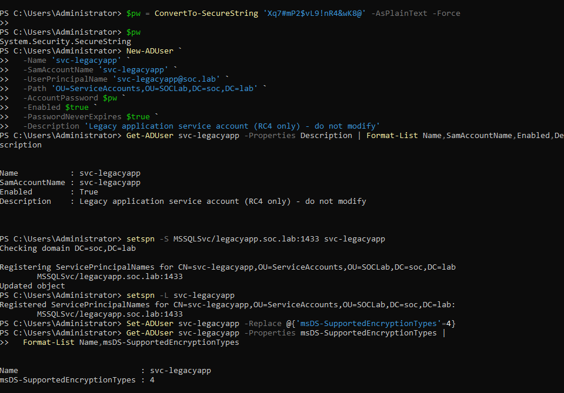

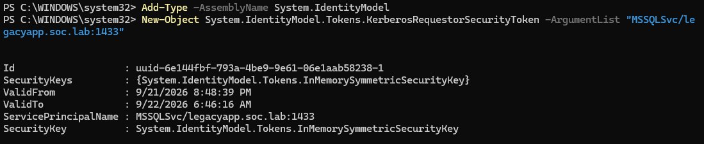

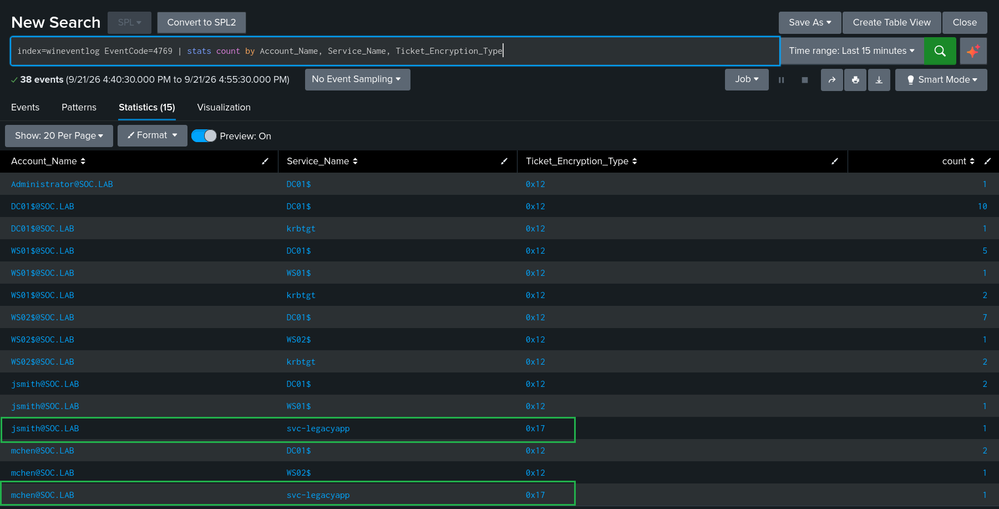

---

## Attack

Performed from Kali (`ATTACK01`, 10.10.10.30) as `SOC\jsmith`, an
unprivileged user.

**1. Request the roastable ticket** (svc-sql in RC4-enabled state):
```
impacket-GetUserSPNs soc.lab/jsmith:'<password>' -dc-ip 10.10.10.10 -request-user svc-sql
```
Returned a `$krb5tgs$23$` (RC4/etype 23) hash.

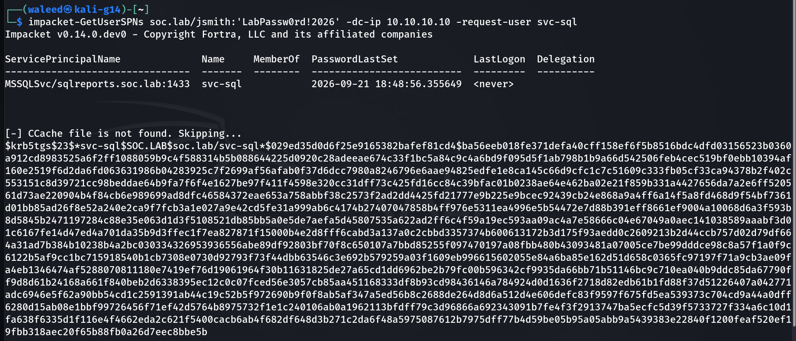

**2. Crack offline.** Three approaches, in increasing attacker knowledge:

*Blind dictionary — failed.* Against stock rockyou, the password is not a known-breached string:
```
john --format=krb5tgs --wordlist=/usr/share/wordlists/rockyou.txt svc-sql.hash    # 0 cracked
```

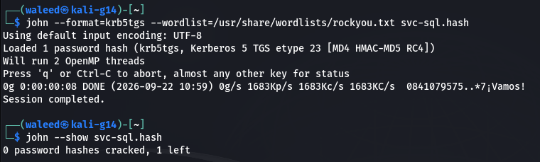

*Blind rule-based — infeasible.* Applying a large mangling ruleset to every
wordlist entry (the untargeted way to construct passwords from base words) was
computationally impractical on this CPU-only host — estimated ~4 days, aborted
at 0.23%:
```
john --format=krb5tgs --wordlist=/usr/share/wordlists/rockyou.txt --rules=Jumbo svc-sql.hash
# aborted: 0g 0:00:14:06 0.23% (ETA: 4 days)
```

*Pattern-informed mask — under one second.* Assuming knowledge of the org's
password pattern (Season + 4-digit year + symbol) — a practical assumption made to speed up the process and demonstrate the technique, since password complexity policies often produce similar patterns — the mask collapses the keyspace:
```
john --format=krb5tgs --mask='Summer?d?d?d?d?s' svc-sql.hash    # cracked: Summer2026!
```

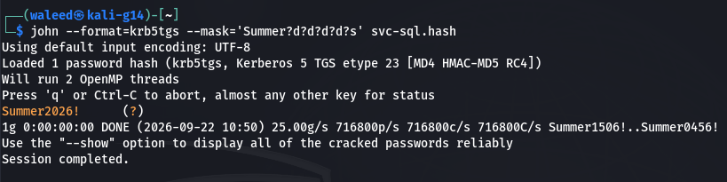

**Kill chain complete:** unprivileged user → service ticket → offline crack →
cleartext service-account credential.

---

## Detection

### Successful roast (RC4-enabled target)

Event 4769 (Kerberos service ticket requested) fires on the DC with the real
encryption type:

| Field | Value |
|---|---|
| EventCode | 4769 |
| Service_Name | svc-sql |
| Ticket_Encryption_Type | `0x17` (RC4) |
| Account_Name | jsmith |
| Failure_Code | 0x0 (success) |

The problem: this is **indistinguishable by encryption type alone** from the
benign `svc-legacyapp` requests, which are also `0x17`. A rule keying only on
RC4 fires on both. (Highlighted with Red)

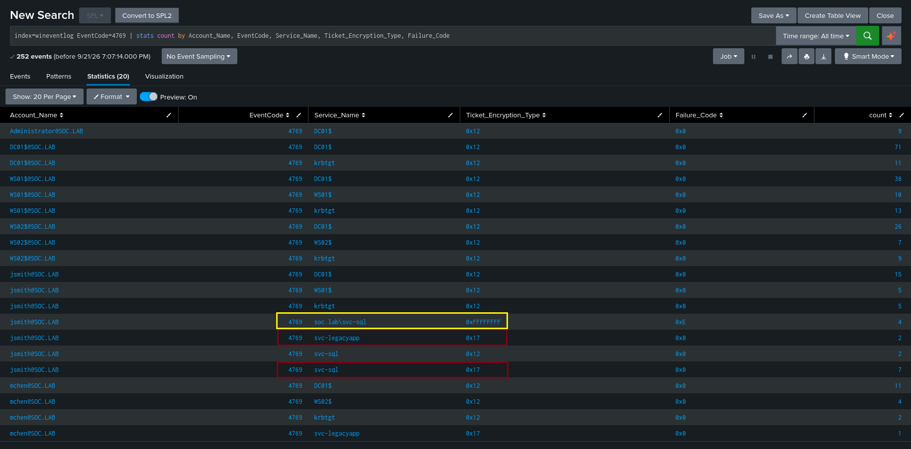

### Hardened target refuses the roast

With `svc-sql` set to AES-only (`msDS-SupportedEncryptionTypes = 24`), the
same RC4 request is rejected by the KDC (Highlighted with Yellow):
```
KDC_ERR_ETYPE_NOSUPP (0xe)
```

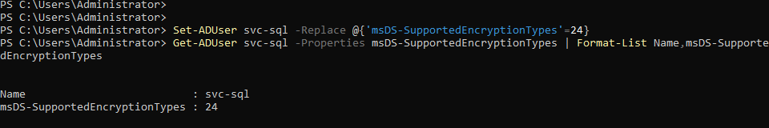

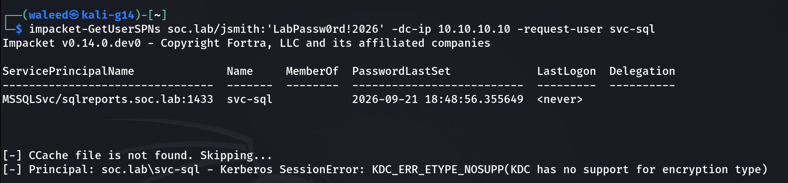

The failed 4769 has a distinct signature:

| Field | Value |
|---|---|
| EventCode | 4769 |
| Service_Name | svc-sql |
| Ticket_Encryption_Type | `0xffffffff` (no ticket issued) |
| Failure_Code | `0xe` (KDC_ERR_ETYPE_NOSUPP) |

---

## Findings

**1. The RC4-only rule has a real false positive.** The benign legacy
account and the attack both request `0x17`.

**2. `Failure_Code=0xe` is a clean signal for the naive roast.** A failed RC4
request against an AES-capable account has no benign explanation in this
environment — legitimate RC4 (the legacy account) *succeeds*; it never
produces `0xe`. This search returned **only** the attack attempts, zero
benign hits:
```
index=wineventlog EventCode=4769 Failure_Code="0xe" | stats count by Account_Name, Service_Name
```
Result: only `svc-sql` requests returned — zero hits from the benign legacy
account (whose RC4 requests all succeed).

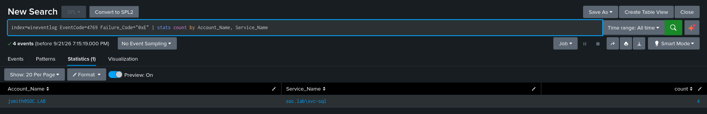

**3. Offensive tooling is itself telemetry.** Staging Rubeus.exe on WS01 as
`jsmith` was flagged by Microsoft Defender on write. Defender's detection
event is an additional, independent signal — endpoint AV catching the tool
even before it runs.

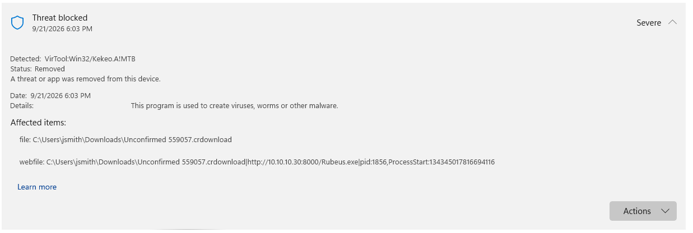

**4. The attack needed no privilege.** Every step ran as an unprivileged
domain user. This is the realistic enterprise starting point.

---

## Tuning

The naive rule and its problem:
```
# Fires on the benign legacy account too
index=wineventlog EventCode=4769 Ticket_Encryption_Type="0x17"
```

Simply excluding the legacy account by name creates a permanent blind spot: an
attacker who roasts `svc-legacyapp` itself would be missed. The useful question
is which variants of this attack a signature *can* catch, and where that
approach runs out. This lab covers the following cases:

### 1. The successful roast (what was done)

With `svc-sql` configured RC4-only, an unprivileged user requested its service
ticket, received an RC4 (`0x17`) hash, and cracked it offline to `Summer2026!`.
This is the full kill chain, and it succeeds.

The resulting 4769 is a successful RC4 request — and it is **indistinguishable
by fields alone** from the benign `svc-legacyapp` requests, which are also
successful `0x17`. That collision is the core detection problem this section
works through.

See [Sigma Rule](../../sigma/kerberoast_rc4_success_baseline.yml).

```
index=wineventlog source="WinEventLog:Security" EventCode=4769 Ticket_Encryption_Type="0x17" Failure_Code="0x0"
```

### 2. The blocked roast — cleanly detectable (validated)

When `svc-sql` was set to AES-only, the same RC4 request was *refused* by the
KDC:

| Field | Value |
|---|---|
| EventCode | 4769 |
| Ticket_Encryption_Type | `0xffffffff` (no ticket issued) |
| Failure_Code | `0xe` (KDC_ERR_ETYPE_NOSUPP) |

This is a pure field match with zero benign overlap — legitimate RC4 (the
legacy account) *succeeds* and never produces `0xe`. Validated against live
telemetry: the search returned only the attack attempts, no benign hits.

See [Sigma Rule](../../sigma/kerberoast_etype_downgrade_failure.yml).

```
index=wineventlog source="WinEventLog:Security" EventCode=4769 Ticket_Encryption_Type="0xffffffff" Failure_Code="0xe"
```

This is the high-fidelity win, but note its scope: it only fires when the
attacker requests RC4 against an account that *refuses* it. It catches the
naive roast against a hardened account. It does **not** catch the successful
roast from section 1, where the ticket was actually issued.

### 3. Catching the successful RC4-against-RC4 roast — the limit

This is the hard case, and it is where signature detection runs out.

The malicious event (`4769, 0x17, success, svc-sql`) and the benign event
(`4769, 0x17, success, svc-legacyapp` from `jsmith`/`mchen`) differ only in
*which account* was requested. So the naive rule cannot separate them, and
excluding the legacy account by name would blind you to an attacker roasting
that account directly.

What a signature *can* lean on is behavior rather than the single event —
**fan-out**: a real user requests one service's ticket because they are using
it; a roasting tool requests many distinct SPNs from one principal in a tight
window. That pattern is expressible as a volumetric threshold
(`count(distinct ServiceName) by Account_Name` over a short window). Its limits
are real and worth stating: a fixed threshold false-positives on legitimate
bulk operations (monitoring services, login scripts) and false-negatives on an
attacker who paces requests slowly. It catches the *noisy* roast, not the
*patient* one.

And the patient roast against a legitimately-RC4 account is the floor: an
attacker requesting one RC4 ticket, slowly, for an account that is supposed to
use RC4, produces an event that is genuinely identical to normal use. No
signature over single events can catch it, because the distinguishing
information is not in the event — it is in the account's history (has this
principal ever requested this SPN, at this rate, before?). Answering that needs
stateful behavioral baselining, not a
signature rule.

### The takeaway

Signature detection has a floor, and it is defined by what information lives
in the event versus in the behavior. Encryption-type and field-match rules
cover the noisy and misconfigured attacker completely; they cannot, even in
principle, catch a patient attacker roasting only legitimately-RC4 accounts.
Crossing that floor requires stateful behavioral analytics. Knowing *where*
a detection method stops working and choosing the right tool is the point.

### Coverage boundary — the competent AES roast

Separately from the RC4 cases above: `Failure_Code=0xe` does **not** catch an
attacker who requests **AES** directly (Rubeus, or impacket `getST` letting
the DC choose the cipher). That request *succeeds* and produces a normal-
looking `0x12` 4769. Catching it needs the same behavioral signal as case 3 —
successful service-ticket requests for service-account SPNs from a user logon
context, correlated with volume/rarity — not encryption type. Full coverage
needs the failure signal, the unexpected-account signal, **and** behavioral
analytics.

---

## Attack-to-telemetry mapping

| Technique variant | Log source | Event ID | Key fields | Detection method | Status |
|---|---|---|---|---|---|
| Successful RC4 roast (RC4-only acct) | DC Security | 4769 | `enc=0x17`, success | — (collides with benign; see below) | Simulated; kill chain to cracked password |
| Blocked roast (RC4 vs AES-only acct) | DC Security | 4769 | `enc=0xffffffff`, `Failure_Code=0xe` | Field match — `sigma/kerberoast_etype_downgrade_failure.yml` | **Validated** against live telemetry |
| Noisy roast (fan-out, RC4-only acct) | DC Security | 4769 | `enc=0x17`, success, many distinct SPNs / one principal | Volumetric threshold | Discussed only — not simulated |
| Patient roast (RC4-only acct) | DC Security | 4769 | identical to benign | Per-principal behavioral baseline (UEBA) | Conceptual — not signature-catchable |
| Tool staging | Endpoint (Defender) | — | Rubeus.exe write | Defender AV detection | Observed incidentally |

Only the blocked-roast rule is validated against telemetry generated in this
lab. The fan-out and behavioral rows are analysis of where signature detection
extends and where it stops (see Tuning) — not rules shipped in this repo.

---

## Build notes

- Benign RC4 baseline seeded from two real user contexts (WS01/`jsmith`,
  WS02/`mchen`) before any attack, so the false positive is genuine, not
  synthetic.
- `svc-sql` tested in two encryption states via
  `Set-ADUser -Replace @{'msDS-SupportedEncryptionTypes'=N}`: `4` (RC4-only,
  roast succeeds) and `24` (AES-only, roast refused with `0xe`).
- `impacket-GetUserSPNs` (v0.14) requests RC4 by default; against an AES-only
  account this fails with `KDC_ERR_ETYPE_NOSUPP` rather than silently
  downgrading — the DC refuses the weak cipher.

---

## References

- [MITRE ATT&CK T1558.003 — Kerberoasting](https://attack.mitre.org/techniques/T1558/003/)
- [Microsoft — 4769(S, F): A Kerberos service ticket was requested](https://learn.microsoft.com/en-us/previous-versions/windows/it-pro/windows-10/security/threat-protection/auditing/event-4769)
- [Microsoft — msDS-SupportedEncryptionTypes / Kerberos encryption type flags](https://learn.microsoft.com/en-us/windows-server/security/kerberos/kerberos-supported-encryption-types)
- [RFC 3961 — Kerberos encryption type numbers (etype 23 = RC4-HMAC, 18 = AES256, 17 = AES128)](https://www.rfc-editor.org/rfc/rfc3961)
- [Impacket — GetUserSPNs](https://github.com/fortra/impacket)
