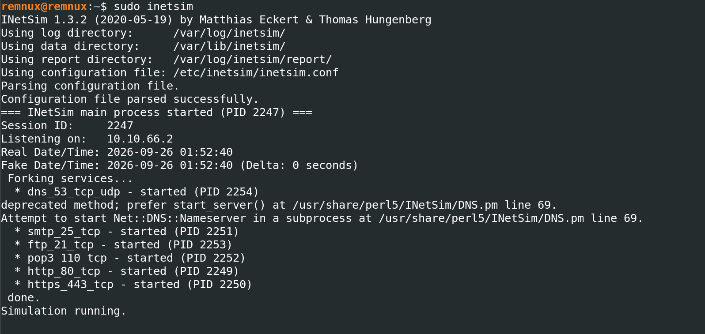
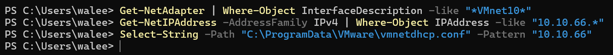
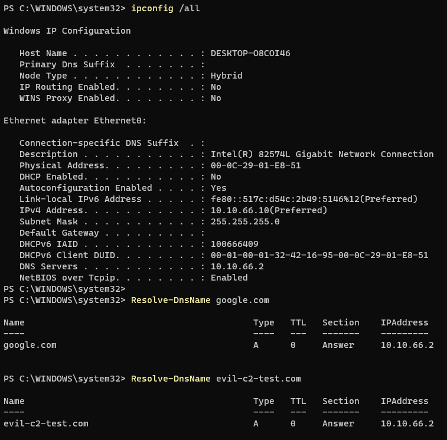

# Project 3 — Malware Analysis & Detection Engineering

Static and dynamic analysis of commodity RATs in an isolated home lab, ending in
tested YARA detection rules for each family. Two malware paradigms are covered:
**managed (.NET)** and **native (C++)**, using different toolchains for each.

> All samples were pulled from MalwareBazaar. Live samples are **not** included
> in this repository

---

## Families Analyzed

| Family | Samples | Type | Config crypto | Toolchain | YARA |
|---|---|---|---|---|---|
| **XWorm** | 4 | .NET | AES-ECB / MD5(mutex) | dnSpy, de4dot | Tested, 0 FP |
| **AsyncRAT** | 1 | .NET | AES-CBC + HMAC / PBKDF2 | dnSpy | Tested, 0 FP |
| **Remcos** | 3 | Native C++ | RC4 (`SETTINGS` resource) | IDA (Hex-Rays) + debugger | Tested, 0 FP |

Detailed writeups:
- [`asyncrat-xworm/`](asyncrat-xworm/README.md) — the .NET family (5 samples labeled
  "AsyncRAT"; config extraction proved a mix of **4 XWorm + 1 AsyncRAT**, two of
  them unpacked from packers via memory dump).
- [`remcos/`](remcos/README.md) — native C++ RE: RC4 config decryption reversed in
  IDA and confirmed at runtime.

---

## Key Findings

- **Label vs. reality:** MalwareBazaar tagged five samples "AsyncRAT"; their
  internals showed four were actually **XWorm**, distinguished by a different
  config-encryption scheme. Detection was built on verified internals, not the
  upstream label.
- **Two packers defeated:** a native C++ loader and a .NET runtime-unpacker were
  both unpacked via memory dump (pe-sieve / ExtremeDumper), exposing their XWorm
  payloads.
- **Native RE:** Remcos's RC4-encrypted `SETTINGS` resource was reversed in IDA
  and the config reproduced offline in Python, then confirmed live in the debugger.
- **Layered visibility:** a dormant XWorm beacon that never completed its TCP
  handshake was invisible to Sysmon (which logs established connections) but
  visible in pcap (SYNs) and Procmon (36 reconnect attempts).
- **Tested detections:** every family is covered by a YARA rule validated against
  its samples and measured for false positives against Windows system binaries.

---

## Lab Environment

Isolated malware-analysis network with no route to the host or home LAN. All
dynamic analysis was performed here and reverted to clean snapshots after each run.

| VM | Role | IP (VMnet10, host-only) |
|---|---|---|
| FLARE-VM | Static + code analysis | 10.10.66.30 |
| Detonation | Dynamic execution / unpacking | 10.10.66.20 |
| REMnux | Fake internet (INetSim) | 10.10.66.2 |

- **VMnet10** — host-only, `10.10.66.0/24`, no host virtual adapter, no DHCP.
  Fully isolated; the Detonation VM uses REMnux (INetSim) as gateway + DNS.
- Isolation verified before every run: no default route, public internet
  unreachable, no path to the host/lab, DNS resolving only to INetSim.
- **Detonation VM:** Windows 11 Enterprise Eval, Sysmon (custom config), Defender
  neutralized, snapshot-reverted per sample.

<br>







---

## Tooling

**Static / code:** Detect It Easy · dnSpyEx · de4dot · IDA (Hex-Rays) 
**Unpacking:** pe-sieve · ExtremeDumper  
**Dynamic:** Sysmon · Procmon · Process Explorer · INetSim · tcpdump · IDA debugger  
**Detection:** YARA  
**Scripting:** Python (pycryptodome, cryptography, pefile)

---

## Repository Layout

```
03-malware-analysis/
├── README.md              # this file
├── asyncrat-xworm/        # .NET family: analysis, YARA rules, decryptors
├── remcos/                # native C++: analysis, YARA rule, decryptor
└── images/                # screenshots
```
