# Malware Analysis — AsyncRAT / XWorm Family

Static and dynamic analysis of commodity .NET RATs in an isolated home lab,
ending in two tested YARA detection rules.  
Five samples were pulled from MalwareBazaar under the label **AsyncRAT**; configuration extraction proved the
batch is actually a **mix of XWorm and AsyncRAT**

> **Headline finding:** Of five "AsyncRAT" labeled samples, config extraction
> identified **four XWorm** and **one AsyncRAT**, distinguished by two entirely
> different config-encryption schemes. Two of the five arrived packed and were
> unpacked via runtime memory dump.

---

## Sample Set

| # | SHA-256 (short) | Family | Crypto | Notable |
|---|---|---|---|---|
| 1 | `ac7e7f56` | XWorm | AES-ECB / MD5(mutex) | Clean baseline, detonated |
| 2 | `eb8b9a20` | XWorm | AES-ECB / MD5(mutex) | Symbol-obfuscated; installs `%ProgramData%\System.exe` |
| 3 | `2b76adf1` | AsyncRAT 0.5.8 | AES-CBC + HMAC / PBKDF2 | Cert `CN=AsyncRAT Server`; 6-domain C2 |
| 4 | `eaad67ae` | XWorm "Coconut" | (payload) AES-ECB | Native C++ packer; orphaning loader |
| 5 | `78ebd82a` | XWorm "Client NS" | (payload) AES-ECB | Packed VB.NET, entropy 7.77 |

> Live samples are **not** included in this repository.

---

## Sample 1 — XWorm (`ac7e7f56`) — Full Analysis

### Phase 1 — Static Triage
Managed .NET, unpacked (entropy 5.59), standard `.text`/`.rsrc`/`.reloc` layout.
DiE's `(Heur)Packer` flag assessed as a **false positive** (no high-entropy
section; fully readable IL) — DiE misfires on .NET's single import + CLR stub.

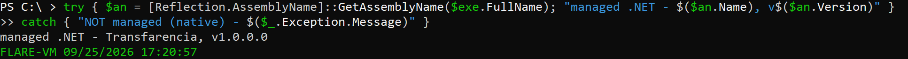

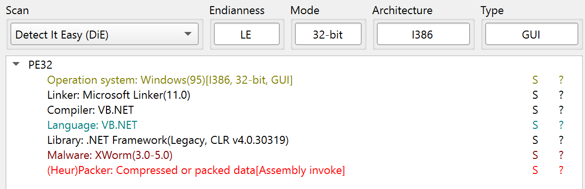

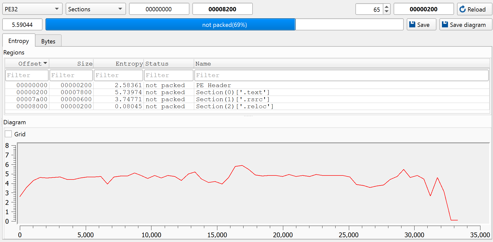

### Phase 2 — Code Analysis (dnSpy)
Config in the `Settings` class (`-` namespace), AES-encrypted. The `KEY`
field is not the key, the AES key is `MD5(Mutex)`, copied into a 32-byte
buffer with an overlapping copy at offset 15. AES-256-**ECB**, no IV/HMAC. A standalone [Python decryptor](../asyncrat-xworm/decrypt_xworm.py) reproduces this offline;
results verified against the dnSpy debugger.

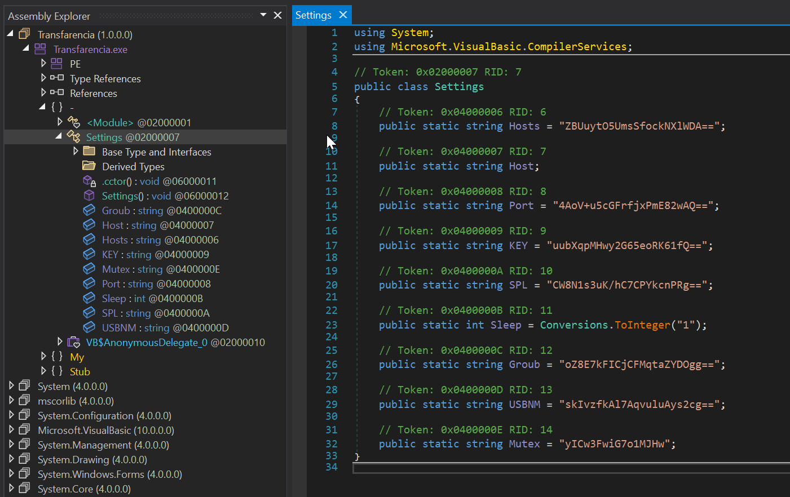

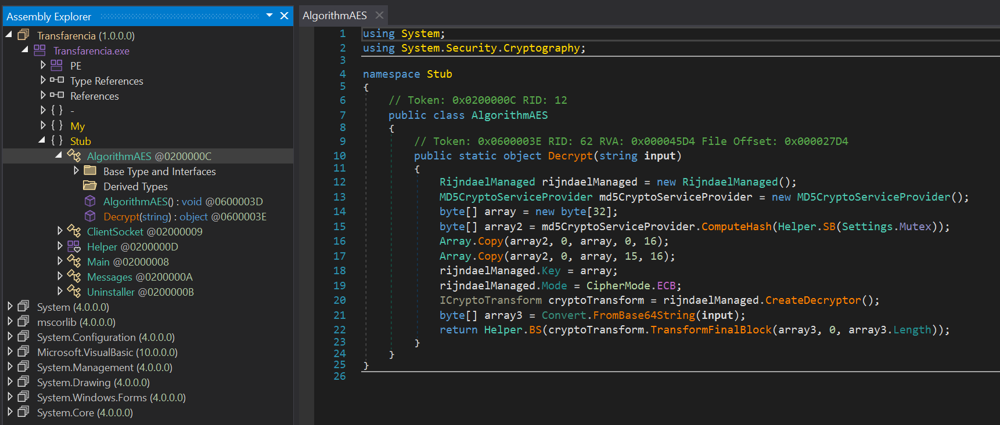

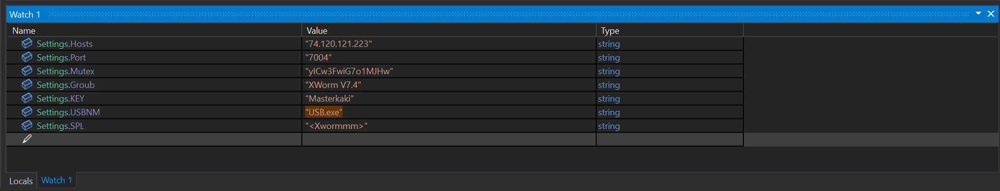

```
Hosts  = '74.120.121.223'
Port   = '7004'
Mutex  = 'yICw3FwiG7o1MJHw'
KEY    = 'Masterkaki'
SPL    = '<Xwormmm>'
Groub  = 'XWorm V7.4'
USBNM  = 'USB.exe'
```

### Phase 3 — Detonation
Process created, mutex held (still running), C2 beacon to `74.120.121.223:7004`
seen in pcap.  
**No persistence:** (0 Run-key writes, 0 file drops). Endpoint
footprint = process-create only.  
Beacon never completed the TCP handshake in the
isolated lab, so Sysmon (which logs established connections) did not record it —
**visible in pcap, invisible to endpoint EDR.**  
**Detection takeaway:** layered
(network + endpoint) monitoring is required.

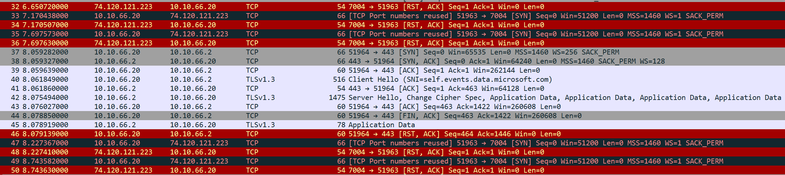

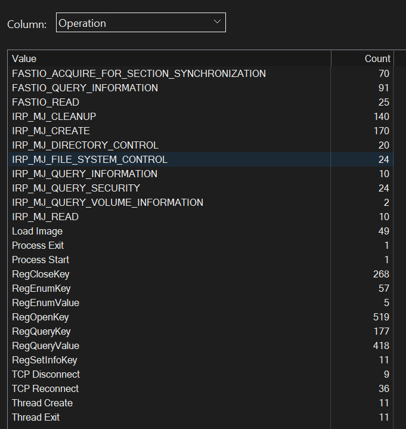

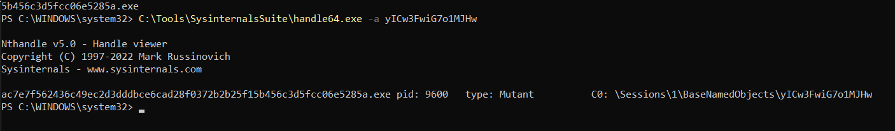

Procmon recorded 36 TCP reconnect attempts to the C2 with 9 disconnects, the beacon loop retrying a connection that never established.  
Registry activity was read-heavy (519 opens, 418 value queries) with no autostart write.

---

## Sample 2 — XWorm (`eb8b9a20`) — Obfuscated Variant

Same `Stub`/AES-ECB lineage as Sample 1, with **symbol obfuscation** (scrambled
field/method names). de4dot reported "unknown obfuscator";
config recovered by mapping the scrambled fields by position + value and running
the ECB decryptor.

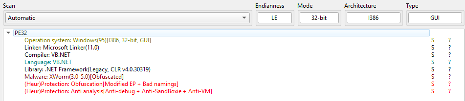

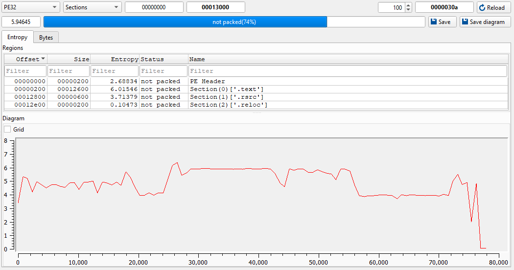

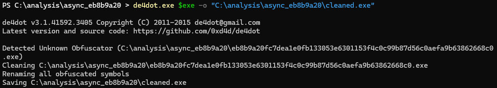

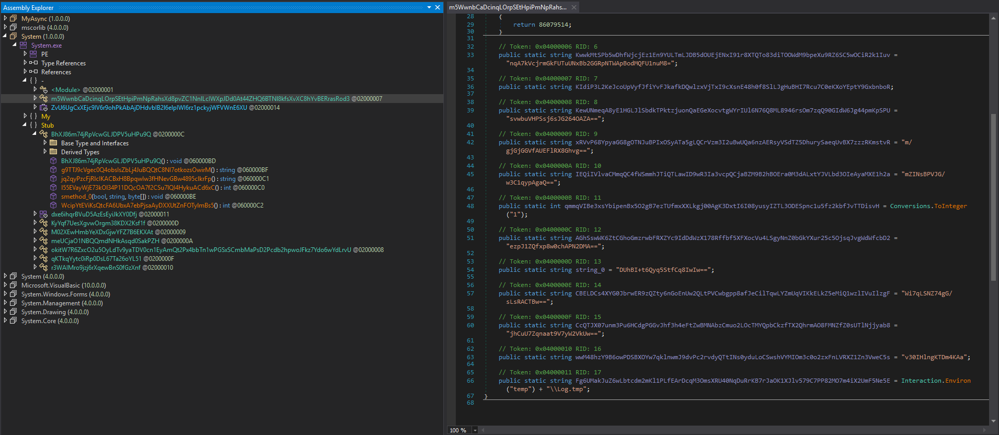

```
Hosts  = '127.0.0.1,188.212.158.34'
Port   = '6000'
KEY    = '<ARTT4848451>'
SPL    = '<Xwormmm>'
Groub  = 'System'
USBNM  = 'USB.exe'
extra1 = '%ProgramData%'
extra2 = 'System.exe'
```

---

## Sample 3 — AsyncRAT 0.5.8 (`2b76adf1`) — Different Crypto

Genuine AsyncRAT (`Client` namespace). **Different encryption scheme:**
AES-256-**CBC** with **HMAC-SHA256** integrity and **PBKDF2** (`Rfc2898DeriveBytes`,
50,000 iterations, fixed salt) key derivation. A second [Python decryptor](../asyncrat-xworm/decrypt_async.py)
(CBC/HMAC) was written for this variant.

- **Attribution:** server certificate `CN=AsyncRAT Server`,
  serial `0xf21b101f5f2bd9a4e261d8426ed0d1`, generated `2026-07-22`.

<br>

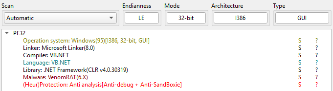

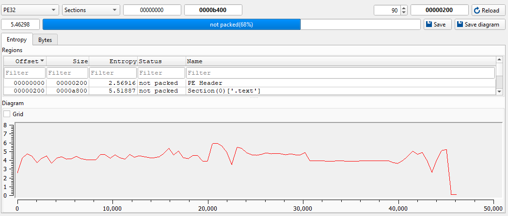

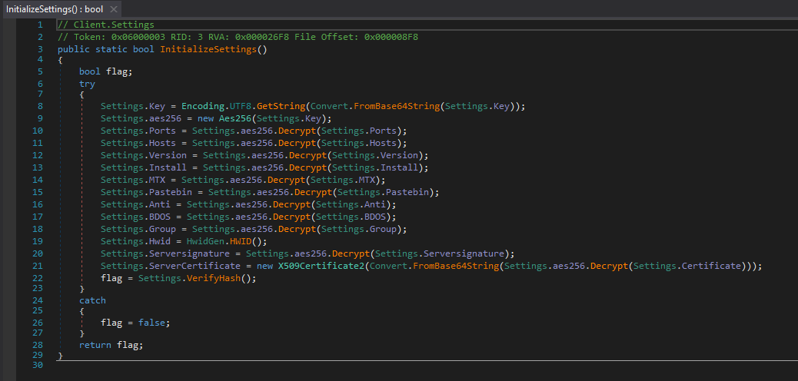

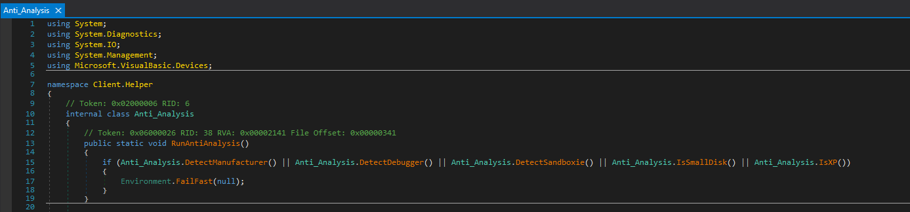

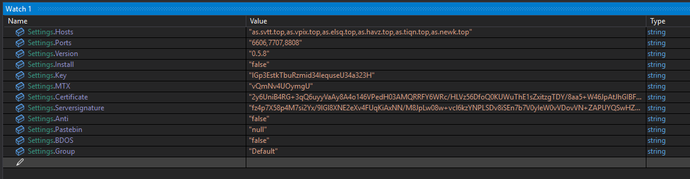

```
Ports    = '6606,7707,8808'
Hosts    = 'as.svtt.top,as.vpix.top,as.elsq.top,as.havz.top,as.tiqn.top,as.newk.top'
Version  = '0.5.8'
Install  = 'false'
MTX      = 'vQmNv4UOymgU'
Anti     = 'false'
Pastebin = 'null'
Group    = 'Default'
```

---

## Sample 4 — XWorm "Coconut" (`eaad67ae`) — Packed, Unpacked via Memory Dump

Native **C++** packer (entropy 7.99), no readable code statically. de4dot N/A
(not .NET). Unpacked by running the sample on the isolated Detonation VM and
dumping the reflectively-loaded .NET payload from memory (pe-sieve /
ExtremeDumper).

- **Loader behavior:** the native stub spawned the payload **jsc.exe** and exited, leaving
  the payload as an **orphaned process** — an evasion technique
  that breaks process lineage.
- **Unpacked payload:** assembly name **"XWorm Coco"**
- **Point:** static triage of the packer revealed nothing; only the memory dump
  exposed the "XWorm Coco" identity.

<br>

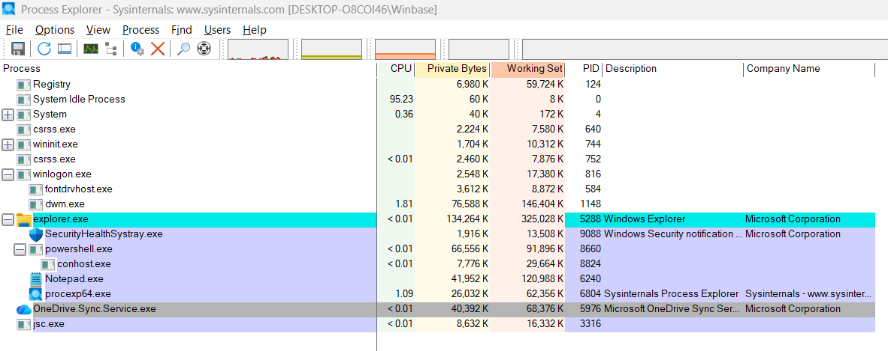

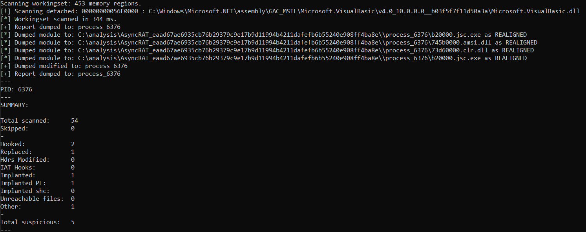

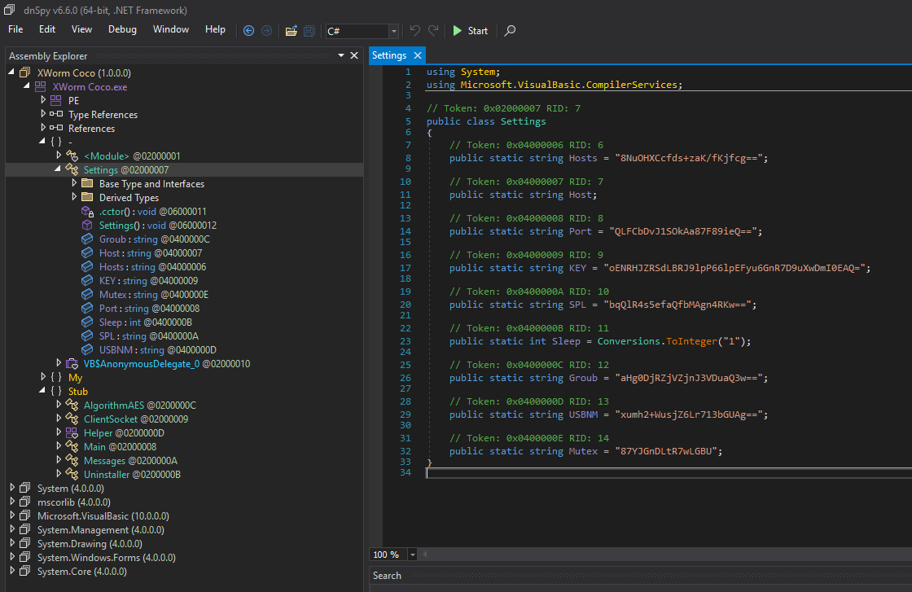

```
Hosts  = '103.83.86.174'
Port   = '2929'
KEY    = '<V7PV7PV7PV7PV7P>'
SPL    = '<Xwormmm>'
Groub  = 'Coconut'
USBNM  = 'USB.exe'
```

---

## Sample 5 — XWorm "Client NS" (`78ebd82a`) — Packed, Unpacked via Memory Dump

VB.NET, entropy 7.77, runtime-unpacking obfuscator. de4dot's generic pass was
insufficient ("unknown obfuscator"), the payload is decrypted into memory at
runtime, not merely renamed. Unpacked by running the sample on the isolated
Detonation VM and dumping the loaded .NET payload with pe-sieve.

- **Unpacked payload:** assembly name **"XWorm Client NS"**
- **Point:** the static scan of the packed file showed nothing usable; the memory
  dump exposed a standard XWorm v7.4 payload.

<br>

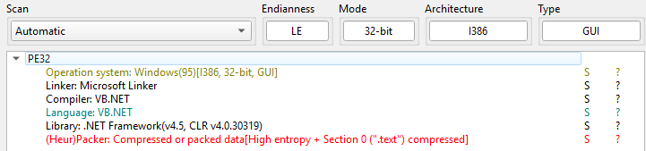

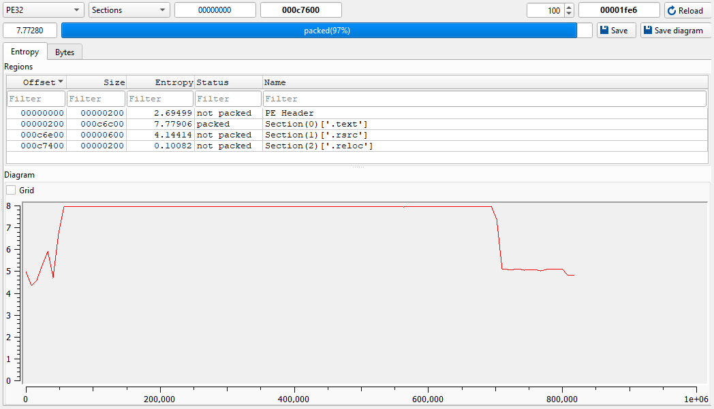

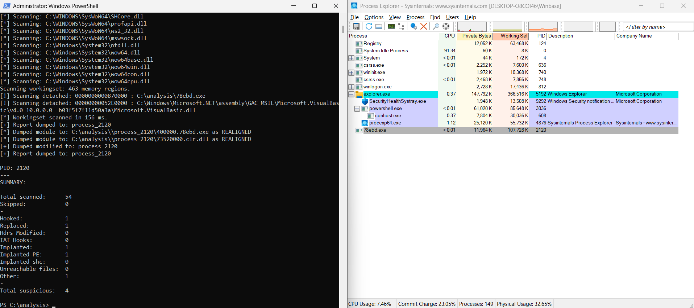

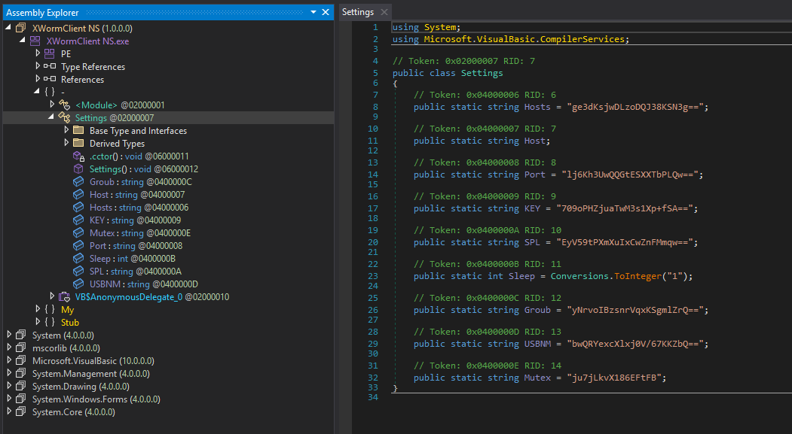

```
Hosts  = '172.94.15.100'
Port   = '6070'
KEY    = '<123456789>'
SPL    = '<Xwormmm>'
Groub  = 'XWorm V7.4'
USBNM  = 'USB.exe'
```

---

## Detection — YARA Rules

Two rules, keyed on **family-stable** features (present across all family
samples regardless of C2 / obfuscation), never on per-build values (C2, mutex,
filename).

### `xworm.yar`
Anchors on the C2 command-dispatch cluster (`StartDDos`, `savePlugin`,
`sendPlugin`, `Shosts`, `PCShutdown`, `Xchat`) + WMI recon queries
(`SELECT * FROM AntivirusProduct`, `SecurityCenter2`, `Win32_VideoController`).
These are functional code that **survived symbol obfuscation** (matched both the
clean and obfuscated samples).

### `asyncrat.yar`
Primary anchor: the hardcoded **PBKDF2 salt** (32 bytes) from the `Aes256` class
— stable across AsyncRAT builds. Fallback: `Serversignature` / `Aes256` /
`Rfc2898DeriveBytes` / `AsyncRAT Server` string cluster.

### Validation results

Rules were run against each sample's **unpacked** form (the two packed samples
were memory-dumped first).

| Sample | Family | XWorm rule | AsyncRAT rule |
|---|---|---|---|
| `ac7e7f56` (clean) | XWorm | Match | — |
| `eb8b9a20` (obfuscated) | XWorm | Match | — |
| `eaad67ae` payload (unpacked) | XWorm | Match | — |
| `78ebd82a` payload (unpacked) | XWorm | Match | — |
| `2b76adf1` | AsyncRAT | — | Match |

<br>

- **XWorm 4/4, AsyncRAT 1/1** — 100% of family samples matched; **zero**
  cross-family matches.
- **Zero false positives** across **5,027** Windows `System32` binaries.
- The XWorm rule matched the obfuscated build and both memory-dumped payloads,
  showing it keys on functional behavior rather than surface features.
- **Note on packing:** content-based YARA cannot match a packed file until it is
  unpacked — demonstrated here by unpacking both packed samples and detecting
  their payloads. Catching the packed originals directly would need a separate
  packer/behavior rule.

<br>

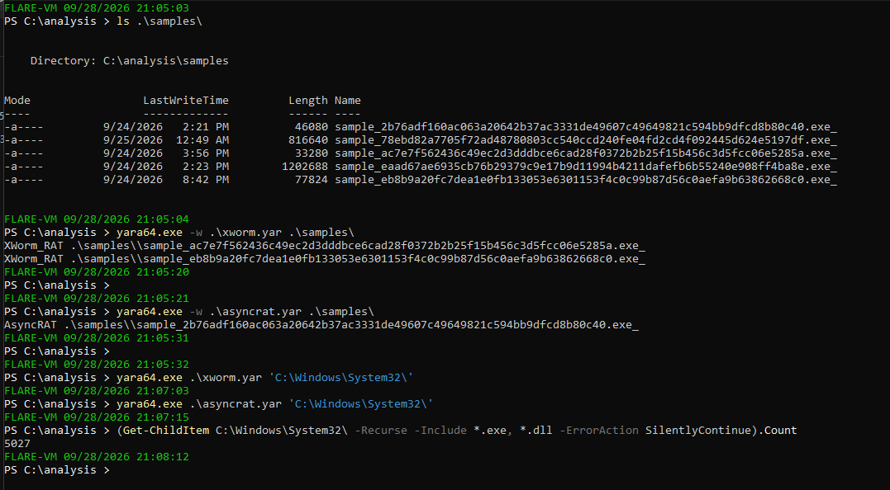

---

## Files

```
decrypt_xworm.py       XWorm config decryptor (AES-ECB / MD5(mutex))
decrypt_async.py       AsyncRAT config decryptor (AES-CBC+HMAC / PBKDF2)
xworm.yar            XWorm YARA rule
asyncrat.yar         AsyncRAT YARA rule
../images/              Screenshots (referenced above)
```

---

## Tooling

Detect It Easy · dnSpyEx · de4dot · Python (pycryptodome, cryptography) ·
pe-sieve · ExtremeDumper · Sysmon · Process Explorer · INetSim · tcpdump · YARA

---
