# Remcos RAT — Native C++ Analysis

A native-code counterpart to the .NET AsyncRAT/XWorm family, analyzed to
demonstrate **native (C++) reverse engineering**. Remcos carries no managed
metadata, so this analysis relied on **IDA (Hex-Rays decompiler)** for static RE
and the **IDA debugger** for dynamic confirmation, rather than dnSpy.

---

## Samples

| Field | Value |
|---|---|
| Family | Remcos (Breaking-Security) |
| Language | Native C++ (Visual C++) |
| Config storage | RC4-encrypted `SETTINGS` resource (RCDATA) |

Three Remcos samples were triaged; the lowest-entropy sample (`e1f`) was selected
for full analysis, as high entropy in the other two indicates packing.

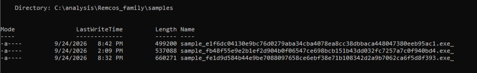

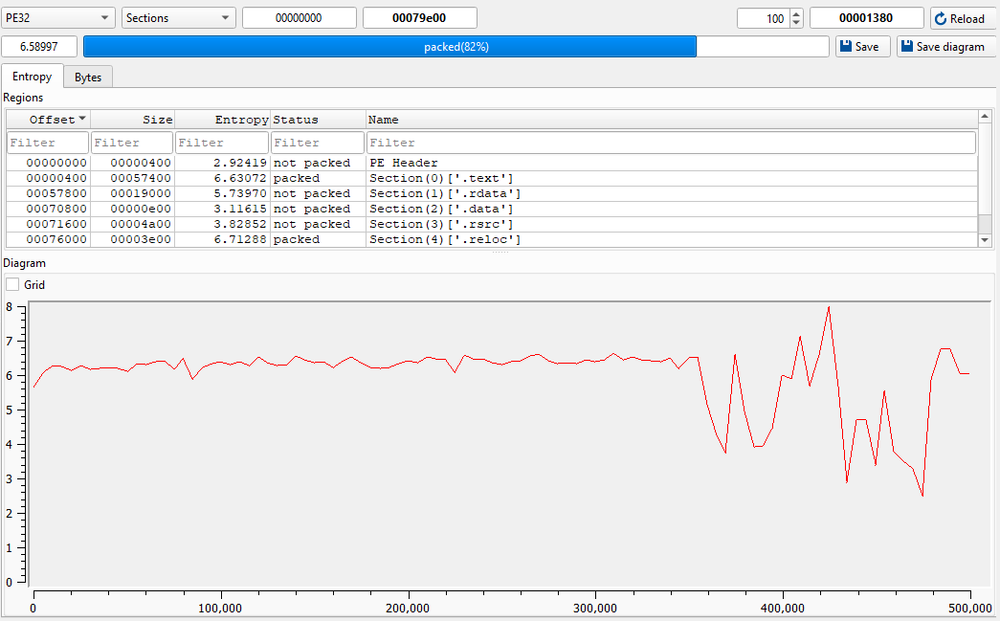

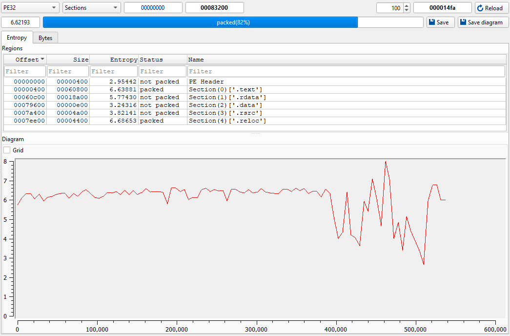

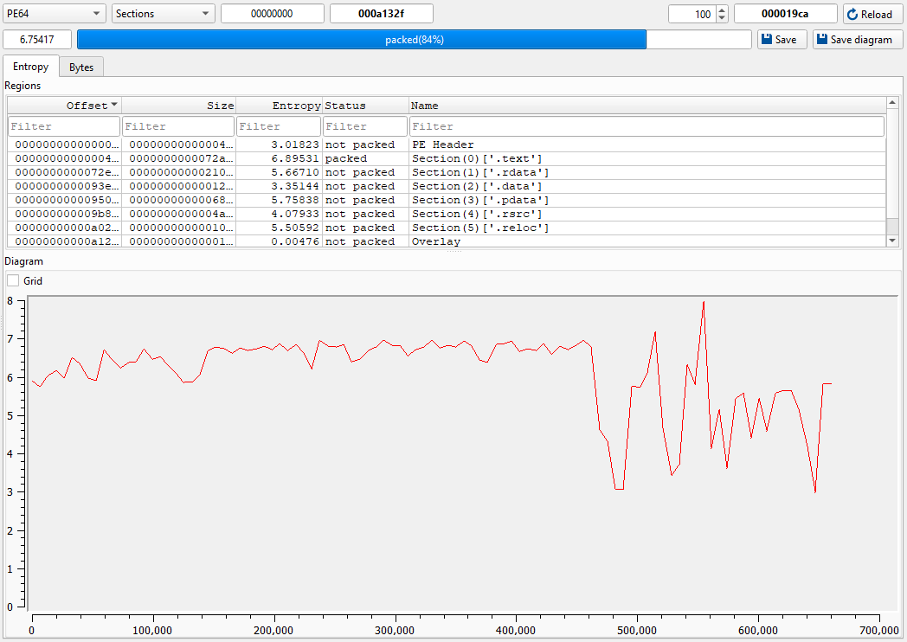

---

## Locating the config

A string search for `SETTINGS` reveals the config embedded as a PE resource.

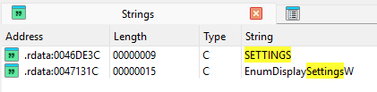

Following the cross-reference to the resource-loading function (`sub_41C09E`) and
tracing back through its callers leads to `sub_40F605` — the routine that loads
and decrypts the config blob.

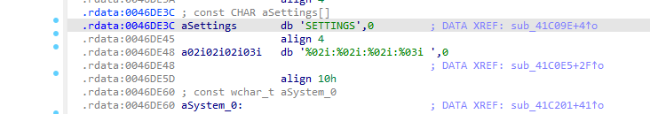

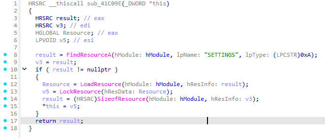

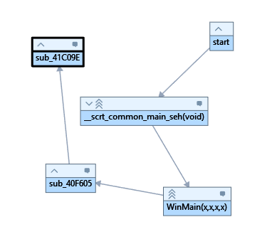

`sub_40F605` sets up and drives the RC4 decryption through several helper calls.

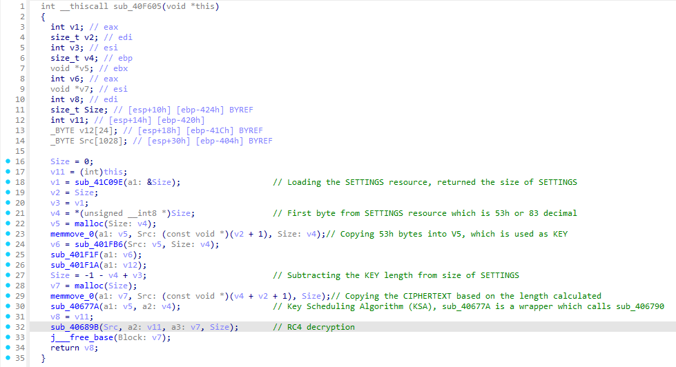

---

## Config decryption (reversed in IDA)

Remcos stores its configuration in a PE resource named **`SETTINGS`**, encrypted
with **RC4**. The resource layout is:

```
[1 byte: key length][key][RC4-encrypted config]
```

`sub_40F605` reads the first byte as the key length, extracts that many bytes as
the RC4 key, then decrypts the remaining ciphertext into a heap buffer. The RC4
implementation splits across two helpers:

**`sub_406790` — RC4 key schedule (KSA):** initializes a 256-entry S-box and
permutes it with the key.

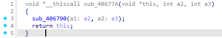

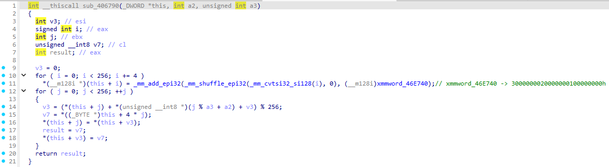

**`sub_4067FF` — RC4 keystream (PRGA):** generates the keystream and XORs it
against the ciphertext.

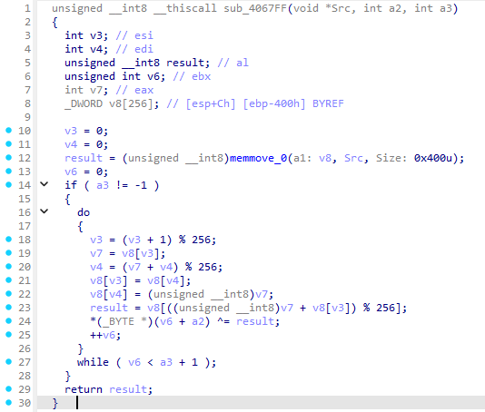

The scheme was reproduced offline in Python ([decrypt_remcos.py](decrypt_remcos.py)) and confirmed at runtime.

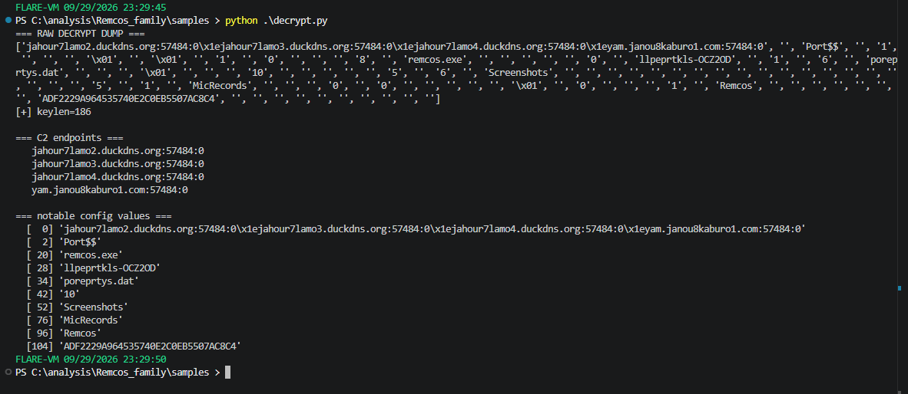

---

## Extracted config

| Field | Value |
|---|---|
| C2 | `jahour7lamo2.duckdns.org:57484`, `...lamo3...`, `...lamo4...`, `yam.janou8kaburo1.com:57484` |
| Transport | TCP (`:0` = no TLS) |
| Mutex | `llpeprtkls-OCZ2OD` |
| Install name | `remcos.exe` |
| Keylog file | `poreprtys.dat` |
| Screenshot dir | `Screenshots` |
| Audio capture dir | `MicRecords` |
| Group | `Remcos` |
| Build / license ID | `ADF2229A964535740E2C0EB5507AC8C4` |

The four DuckDNS dynamic-DNS endpoints let the operator re-point C2 without
rebuilding the payload. Configured keylog, screenshot, and microphone-capture
paths show full surveillance capability is enabled in this build.

---

## Dynamic confirmation (IDA debugger)

A breakpoint set immediately after the RC4 routine (`sub_40689B`, at `0x40F69D`)
caught the decrypted config: `EAX` pointed to a heap buffer (`0x006BDD98`) holding
the **contiguous plaintext** — `jahour7lamo2.duckdns.org:57484:0` — matching the
Python output exactly.

- **Config lifecycle:** the config is decrypted into a contiguous heap buffer,
  then parsed into individual **UTF-16** field objects. Later in execution only the
  scattered wide-char fields remain — there is no contiguous plaintext blob at
  rest, which is why an initial ASCII memory search returned nothing.
- The subsequent load of `rasadhlp.dll` confirmed the sample moved on to resolving
  its C2 domains, tying the static config to observed network behavior.

<br>

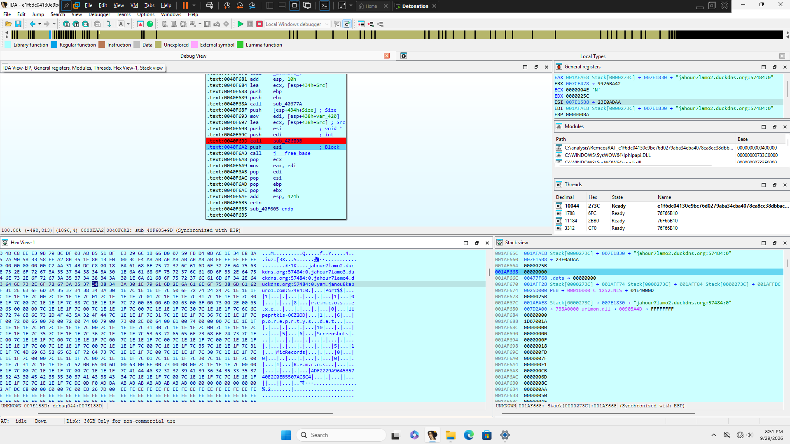

## Detection — `remcos.yar`

Keys on the `SETTINGS` resource marker plus Remcos / Breaking-Security vendor
strings and capability artifacts (`Watchdog`, `Keylogger`, `MicRecords`,
`Screenshots`). Never keys on the per-build C2 or mutex.

| Test | Result |
|---|---|
| Remcos samples matched | 3 / 3 |
| False positives (5,000+ System32 binaries) | 0 |

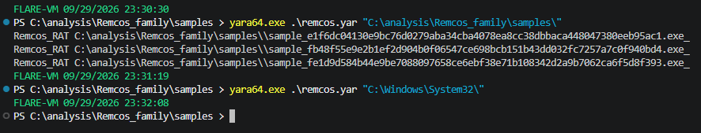
